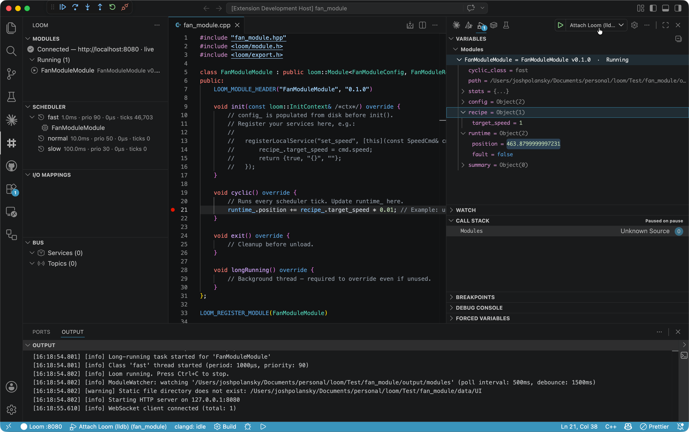
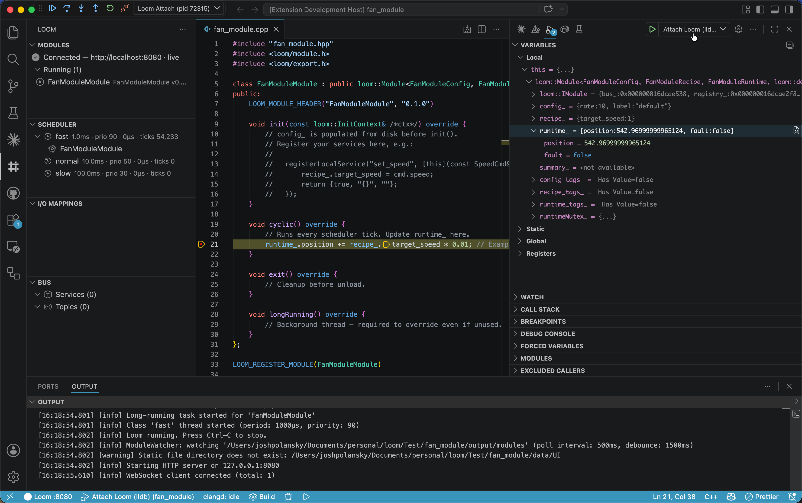

# Loom for VS Code

Build, run, and debug [Loom](https://github.com/Joshpolansky/Loom) modules from VS Code. Scaffold a module project in one command, see every running module's live state in the Variables panel, hit breakpoints in your C++ code with a real debugger, and hot-reload changes without restarting the runtime.

## Quick start

1. Install this extension from the Marketplace.
2. Run **`Loom: Install Loom Runtime…`** — downloads the latest Loom release, configures the extension, and registers the SDK with CMake so `find_package(loom)` just works.
3. Run **`Loom: New Module Project…`** — pick a folder and a name. You get a complete CMake project with the build task, attach-by-pid debug config, and output paths already wired.
4. Open the new project, press `Cmd/Ctrl+Shift+B` to build, then click the Loom icon in the activity bar and hit **Start Runtime**. Your module loads automatically.

That's it. Edit → save → rebuild — the runtime hot-reloads.

## Screenshots

**Live module inspection** — the `Loom: Inspect Modules` debug session surfaces every running module as nested variables (config / recipe / runtime / summary) in VS Code's Variables panel.

**Native debug** — `Loom: Debug Runtime (Native)` launches the runtime under CodeLLDB or Microsoft C/C++ so you can hit breakpoints in your module code while the Loom side panel keeps a live read on modules, scheduler, and bus.

## What you get

- **Module project scaffold** — `Loom: New Module Project…` creates a CMake project with the SDK pre-wired, build/attach tasks, and `.vscode/settings.json` pointing at the workspace's `output/modules/` so the runtime picks up your builds automatically.
- **Modules side panel** — every loaded module grouped by state (Running / Initialized / Error / …) with live cycle time and overrun counts streamed over WebSocket. Right-click for reload, remove, save/load config, or jump to source.
- **Live variable inspection** — `Loom: Inspect Modules` opens a debug session that exposes every module's `config`, `recipe`, `runtime`, and `summary` trees in the Variables panel. Right-click any field → `Set Value…` to edit it without races against the live-tick.
- **Native C++ debug** — `Loom: Debug Runtime (Native)` or `Loom: Attach Native Debugger` launches/attaches under CodeLLDB or Microsoft C/C++ so you can set breakpoints in your module source.
- **Scheduler panel** — every scheduler class with period, priority, CPU affinity, and live tick stats. Right-click to retune.
- **Bus panel** — every RPC service registered by your modules; click to invoke with a JSON body.
- **Module management** — `Loom: Manage Modules…` opens a tabbed UI for instantiate / hot-reload / save-config / remove / upload across every available `.so`.

## Connecting to a runtime

The simplest setup — the install command above — runs the binary on `localhost:8080`. Two other options:

- **Connect to a remote runtime** (running on another machine, embedded target, or PLC). Set `loom.serverUrl` to its address; the inspect / module / scheduler / bus views all work without a local binary.
- **Build Loom from source.** Set `loom.repoPath` to your Loom checkout and the extension derives the runtime executable, module dir, and data dir from it.

## Native debug

Set `loom.debugAdapter` to `lldb` (default, recommended on macOS) or `cppdbg`, then install the matching extension:

- [CodeLLDB](https://marketplace.visualstudio.com/items?itemName=vadimcn.vscode-lldb) for `lldb`
- [Microsoft C/C++](https://marketplace.visualstudio.com/items?itemName=ms-vscode.cpptools) for `cppdbg`

`Loom: Debug Runtime (Native)` launches the runtime under the debugger; `Loom: Attach Native Debugger` attaches to a runtime that's already running. Either way, breakpoints in your module's `.cpp` hit normally.

## Commands

All commands are under the `Loom:` palette prefix.

**Getting set up**
- `Loom: Install Loom Runtime…` — download the latest release and configure paths
- `Loom: New Module Project…` — scaffold a new module project
- `Loom: Connect to Runtime…` — change `loom.serverUrl`

**Runtime lifecycle**
- `Loom: Start Runtime` / `Loom: Stop Runtime` / `Loom: Restart Runtime`
- `Loom: Debug Runtime (Native)` — launch under the C/C++ debugger
- `Loom: Attach Native Debugger` — attach to a running loom process

**Working with modules**
- `Loom: Manage Modules…` — instantiate, reload, save/load config, upload
- `Loom: Inspect Modules` — open the live Variables view
- `Loom: Open Module Source` — jump to the `.cpp` for a module (right-click in tree)
- `Loom: Instantiate Module…` / `Loom: Upload Module…`

**Bus**
- `Loom: Call Bus Service…` — pick a service, send a JSON request, response logs to the `Loom` output channel

## Settings

Most settings are managed for you by the install and scaffold commands. The ones you might touch:

| Key | Default | When to change it |
| --- | --- | --- |
| `loom.serverUrl` | `http://localhost:8080` | Pointing at a remote runtime. |
| `loom.port` | `8080` | Port conflict, or you want a non-default port. |
| `loom.bindAddress` | `127.0.0.1` | Expose the runtime on the LAN — set to `0.0.0.0`. Default keeps it local-only. |
| `loom.debugAdapter` | `lldb` | Using Microsoft C/C++ instead of CodeLLDB — set to `cppdbg`. |
| `loom.repoPath` | *(empty)* | Building Loom from source — set to your checkout. |

Advanced / less common: `loom.runtimeExecutable`, `loom.userModuleDir`, `loom.systemModuleDir`, `loom.dataDir`, `loom.releaseRepo`, `loom.releaseAssetTemplate`, `loom.pollIntervalMs`. See the **Loom** section in VS Code's settings UI for the full reference.

## License

Apache-2.0 — see [LICENSE](LICENSE).
